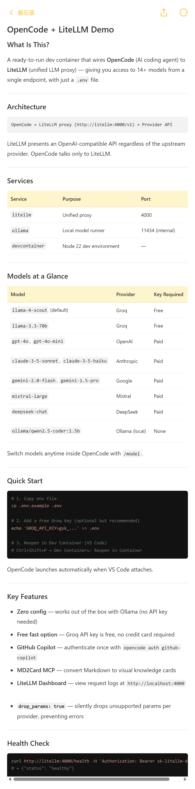

# OpenCode + LiteLLM + OpenRouter + Sandbox Demo

A demo repository showing [OpenCode](https://opencode.ai) running in a dev container with two provider options: [LiteLLM](https://docs.litellm.ai) as a proxy for all major LLM providers, and [OpenRouter](https://openrouter.ai) as a native direct provider with free models — all configured with just a `.env` file.

## Demo Video


## Knowledge Cards 

Are a new way to document and share knowledge. They distill complex information into concise, visual formats that are easier to understand and remember. With the MD2Card MCP server included in this demo



**Recommended: Get a free [Groq API key](https://console.groq.com)** (email only, no credit card) for fast responses out of the box. Ollama is available as a local fallback but is slow on CPU-only machines.

## What's Included

- **OpenCode** — AI coding agent, auto-launches on container attach
- **LiteLLM** — Proxies OpenAI, Anthropic, Gemini, Mistral, Groq, Cohere, Together AI, Perplexity, xAI, DeepSeek, and Ollama
- **OpenRouter** — Direct provider with free models (no LiteLLM involved)
- **Ollama** — Runs `qwen2.5-coder:1.5b` locally, no API key required
- **LiteLLM Dashboard** — accessible at `http://localhost:4000` from your browser
- **MD2Card MCP Server** — Convert Markdown to beautiful knowledge cards (optional)
- VS Code extensions: GitHub Copilot, GitHub Copilot Chat, OpenCode

## Prerequisites

- [Docker](https://www.docker.com/products/docker-desktop)
- [VS Code](https://code.visualstudio.com/) with the [Dev Containers extension](https://marketplace.visualstudio.com/items?itemName=ms-vscode-remote.remote-containers)

## Getting Started

### 1. Copy the env file

```bash
cp .env.example .env
```

The file must exist (even if empty) or Docker Compose will fail to start.

**For fast responses:** open `.env` and add your Groq key:

```
GROQ_API_KEY=gsk_...
```

Get one free at [console.groq.com](https://console.groq.com). Without a key, OpenCode falls back to Ollama — which works but is slow (~60–100s per response on CPU-only hardware).

**Alternative: Use OpenRouter free models** — add your OpenRouter key instead (or in addition):

```
OPENROUTER_API_KEY=sk-or-v1-...
```

Get one free at [openrouter.ai](https://openrouter.ai). No credit card required.

### 2. Open in Dev Container

Open this folder in VS Code, then when prompted click **Reopen in Container** — or open the Command Palette (`Ctrl+Shift+P` / `Cmd+Shift+P`) and run:

```
Dev Containers: Reopen in Container
```

The dev container, LiteLLM, and Ollama all start automatically. `qwen2.5-coder:1.5b` is pulled on first start (~986 MB — this may take a few minutes). OpenCode launches when VS Code attaches.

### 3. Start coding

OpenCode defaults to **Llama 4 Scout via Groq** if `GROQ_API_KEY` is set, otherwise falls back to Ollama. Switch models anytime with the `/model` command.

The LiteLLM dashboard is available at [http://localhost:4000](http://localhost:4000).

## Models

| Model | Provider | Requires | Speed |
|---|---|---|---|
| `llama-4-scout` (default) | Groq via LiteLLM | Free API key | Fast |
| `llama-3.3-70b` | Groq via LiteLLM | Free API key | Fast |
| `ollama/qwen2.5-coder:1.5b` | Ollama via LiteLLM | Nothing | Slow on CPU |
| `nvidia/nemotron-3-super-120b-a12b:free` | OpenRouter | Free API key | Fast |
| `openai/gpt-oss-120b:free` | OpenRouter | Free API key | Fast |
| `minimax/minimax-m2.5:free` | OpenRouter | Free API key | Fast |
| `github-copilot/gpt-4o` (see Copilot section) | GitHub Copilot | Copilot subscription | Fast |
| `gpt-4o`, `claude-3-5-sonnet`, etc. | Various via LiteLLM | Paid API key | Fast |

## OpenRouter (Free Models)

OpenRouter is configured as a native provider, connecting directly to `https://openrouter.ai/api/v1` without going through LiteLLM.

### Setup

1. Get a free API key from [openrouter.ai](https://openrouter.ai)
2. Add it to your `.env` file:

```bash
OPENROUTER_API_KEY=sk-or-v1-...
```

3. Restart the dev container to load the key

### Switching to an OpenRouter Model

In OpenCode, press the model picker (or type `/model`) and select **OpenRouter** as the provider. Choose any model from the list, then type a message to test it.

To verify the key is loaded inside the container, run in the terminal:

```bash
echo $OPENROUTER_API_KEY
```

To test the API directly:

```bash
curl -s https://openrouter.ai/api/v1/chat/completions \
  -H "Authorization: Bearer $OPENROUTER_API_KEY" \
  -H "Content-Type: application/json" \
  -d '{"model":"nvidia/nemotron-3-super-120b-a12b:free","messages":[{"role":"user","content":"hi"}],"max_tokens":10}' \
  | grep -o '"content":"[^"]*"'
```

Expected output: `"content":"Hi! How can I help you today?"`

### Available Free Models

| Model | Notes |
|---|---|
| `nvidia/nemotron-3-super-120b-a12b:free` | NVIDIA Nemotron Super 120B |
| `openai/gpt-oss-120b:free` | OpenAI OSS 120B |
| `minimax/minimax-m2.5:free` | MiniMax M2.5 |
| `google/gemma-4-31b-it:free` | Google Gemma 4 31B |
| `google/gemma-4-26b-a4b-it:free` | Google Gemma 4 26B A4B |

> **Note:** Free models on OpenRouter share upstream rate limits across all users. If you get a "provider returned error" or rate limit error, switch to another free model or wait a minute and retry. For dedicated quotas, add your own provider API key at [openrouter.ai/settings/integrations](https://openrouter.ai/settings/integrations).

## GitHub Copilot

GitHub Copilot is available as an additional provider if you have a Copilot subscription (paid, or free for [students and OSS maintainers](https://github.com/features/copilot/plans)).

### Authenticate

Run this once inside the container terminal:

```bash
opencode auth github-copilot
```

Follow the OAuth prompt in your browser. After authenticating, Copilot models appear in the `/model` picker in OpenCode.

### Available Copilot Models

After authenticating, OpenCode shows the full list. Common options include `github-copilot/gpt-4o`, `github-copilot/claude-3-5-sonnet`, and `github-copilot/o3-mini`.

The default model remains **Llama 4 Scout via Groq**. Switch to a Copilot model anytime with `/model`.

## MD2Card Integration

MD2Card is an MCP (Model Context Protocol) server that allows you to convert Markdown documents into beautiful knowledge cards with 20+ themes.

### Setup (Optional)

1. Get a free API key from [md2card.cn](https://md2card.cn/zh/login)
2. Add it to your `.env` file:

```bash
MD2CARD_API_KEY=your_api_key_here
```

3. Restart the dev container to load the MCP server

### Usage

Once configured, you can ask OpenCode to convert markdown to knowledge cards:

```
Convert this README to a knowledge card using md2card with the Apple Notes style
```

Or reference a specific file:

```
@docs/plans/2026-05-10-github-copilot-design.md Convert to a knowledge card using md2card
```

Available themes include: Apple Notes, Instagram, Pop Art, Minimalist, Cyberpunk, and many more. See [md2card.com](https://md2card.com/en) for the full list.

**Note:** The MD2Card MCP server is optional. If you don't configure an API key, OpenCode will still work normally — you just won't have access to the card generation features.

## Testing the Setup

### 1. Verify LiteLLM is up

In the container terminal:

```bash
curl http://litellm:4000/health -H "Authorization: Bearer sk-litellm-demo"
```

Expected: `{"status": "healthy"}`

### 2. Test in OpenCode

Type `hi` — if Groq is configured you should get a response in under 2 seconds.

### 3. Verify Ollama (optional)

```bash
curl http://ollama:11434/api/tags
```

Expected: JSON listing `qwen2.5-coder:1.5b`.

### 4. Check the LiteLLM dashboard

Open [http://localhost:4000](http://localhost:4000) in your browser to see request logs.

## Why is Ollama slow?

OpenCode sends a ~9,500-token system prompt with every message. On CPU-only Docker, Ollama processes ~100 tokens/second during the prefill phase — meaning ~95 seconds of silence before the first word appears. With a GPU it's 5–10x faster. Or just use Groq — it's free.

## Project Structure

```
.devcontainer/
  devcontainer.json       # Dev container configuration
  docker-compose.yml      # Defines devcontainer + litellm + ollama services
  litellm-config.yaml     # LiteLLM model definitions
.env.example              # Copy to .env and add your API keys
opencode.json             # OpenCode pre-configured for LiteLLM, OpenRouter + MD2Card MCP
```
